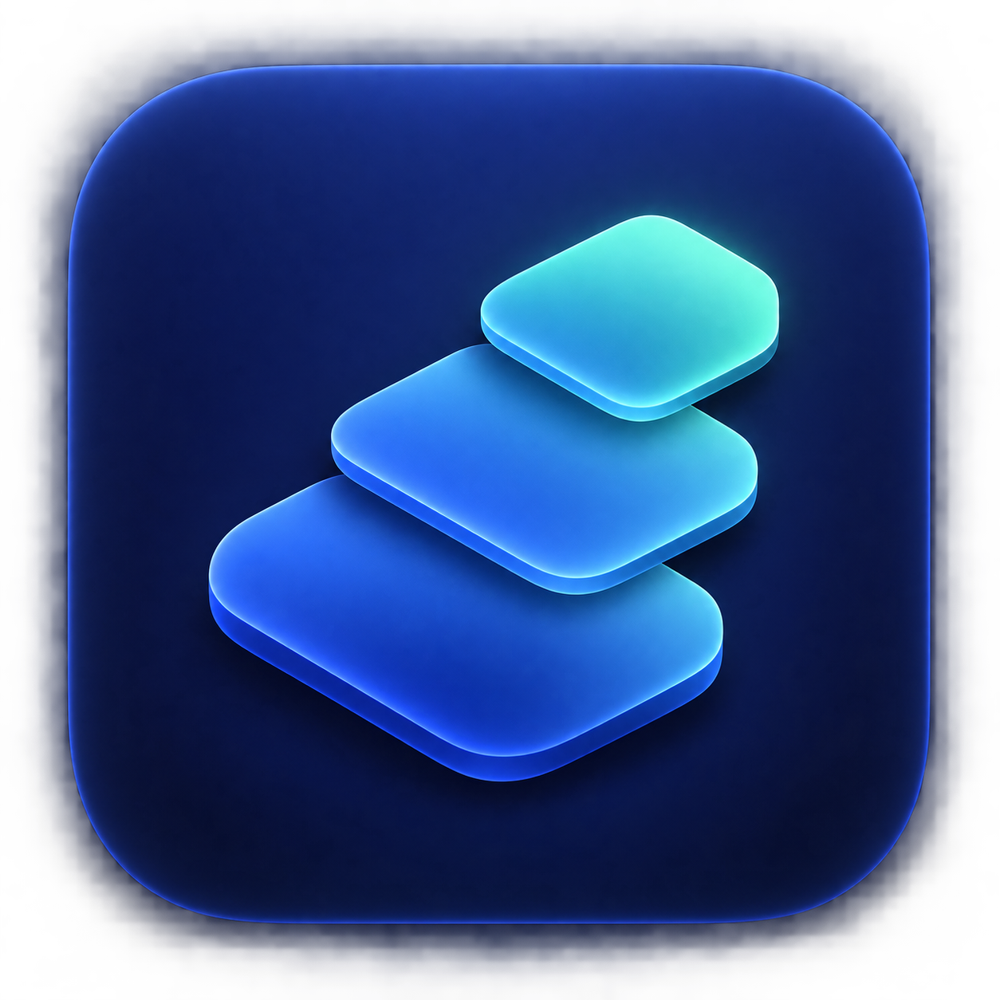

<p align="center">
  
</p>

<h1 align="center">Tokly</h1>
<p align="center">在菜单栏与桌面，查看这台 Mac 的 AI 用量。</p>
<p align="center">A native macOS app for local AI token usage and estimated costs.</p>

Tokly 是一款开源的 macOS AI 用量统计工具。它读取本机 AI 客户端留下的使用记录，把 Token 用量、模型分布和估算费用整理到原生窗口、菜单栏与桌面小组件中。

不用逐个翻日志，也不用把会话上传到另一个服务。

> **社区预览阶段**：当前开发版本为 **0.2.0（build 4）**。仓库提供源码，尚未提供经过跨机器安装验证及 Apple 公证的社区安装包。GitHub 上的 `v0.1.0` 是历史预发布记录。目标系统为 macOS 14+，目前实际运行验证集中在 Apple Silicon / macOS 26。

## 能做什么

- **用量总览**：查看今日、近 7 天和本月的 Token 用量与趋势。
- **模型与客户端明细**：了解用量来自哪个工具、哪个模型，区分输入、输出、缓存与推理 Token。
- **菜单栏速览**：随时查看今日用量，打开弹窗切换日期范围与模型排名。
- **桌面小组件**：提供小号、中号组件，展示今日摘要及实际更新时间。
- **费用估算**：按公开模型单价估算；缺少价格时明确显示，不把未知费用算成免费。
- **本机后台更新**：默认每 10 分钟采集，可切换为 5 分钟；关闭窗口后继续在菜单栏运行，退出应用后停止采集。

Tokly 统计的是**本机记录**，不是账号全部用量。它不查询订阅剩余额度，估算费用也不是实际账单或订阅费。

## 支持哪些工具

目前重点验证了 **Codex、Claude Code 和 OpenCode**。采集核心来自 [missuo/tokens](https://github.com/missuo/tokens)，普通构建还提供上游支持的其他客户端选项；这些来源尚未在 Tokly 中逐一验证，欢迎提供可脱敏复现的问题。

客户端必须在这台 Mac 上留下可读取的记录。没有本地日志的网页或云端用量，不会自动出现。

## 隐私与网络

- 日志解析、用量聚合和统计缓存都在本机完成。
- 桌面小组件读取精简统计摘要，不读取会话正文。
- 当前没有广告、分析追踪 SDK 或账号系统。
- 网络请求用于更新公开模型价表；不会将会话日志或统计上传到价格服务。网络服务仍能看到请求 IP 等连接信息。
- 本机缓存可能包含从源日志解析出的数据，请按个人数据管理，不要上传到 Issue。

普通构建按所选客户端读取其默认数据路径，仍受 macOS 文件权限约束。仓库另有实验性沙盒构建，需要逐项授权目录，详见[实验状态](docs/APP-STORE.md)。

## 获取与构建

当前面向愿意自行构建、参与反馈的社区爱好者。尚无可推荐给普通用户直接安装的公证版下载；项目不要求关闭 Gatekeeper 或系统安全保护。

### 准备环境

- 完整 Xcode（包括 macOS SDK；只有 Command Line Tools 不够）。
- Rust / Cargo / Clippy、Python 3。
- 当前已使用 Xcode 26.6、Rust 1.95.0 验证；更旧工具链和 Intel 机器尚未验证。

```sh
git clone https://github.com/liuyejinghong/Tokly.git
cd Tokly

# 检查脚本使用项目内的离线缓存，首次构建先下载依赖。
mkdir -p .build/cargo-home
CARGO_HOME="$PWD/.build/cargo-home" CARGO_NET_OFFLINE=false \
  cargo fetch --locked --manifest-path Collector/Cargo.toml
CARGO_HOME="$PWD/.build/cargo-home" CARGO_NET_OFFLINE=false \
  cargo fetch --locked --manifest-path Collector/vendor/Cargo.toml

# 验证核心并生成采集器，再构建应用。
python3 scripts/check-upstream.py
bash scripts/check-collector.sh
bash scripts/check-app.sh
```

上面生成的是**不签名的构建检查产物**，位于 `.build/TokensDerivedData/Build/Products/Debug/Tokly.app`，不代表签名、安装和小组件已就绪。

如需在本机运行完整应用和小组件，需要配置可用的开发签名身份与 App Group：

```sh
# 仅首次执行；已有本机配置时不要覆盖。
cp Config/Local.xcconfig.example Config/Local.xcconfig
# 在 Local.xcconfig 中填写你自己的 DEVELOPMENT_TEAM。
bash scripts/build-local.sh
```

默认输出为 `.build/TokensSigned/Build/Products/Release/Tokly.app`。脚本只构建，不自动安装或公证。签名证书、App Group 能力与权限需由你的开发环境提供；仅填入 Team ID 不保证构建成功。详细说明见[开发者指南](docs/DEVELOPER-GUIDE.md)。

## 已知限制

- 还没有自动更新，也尚未验证在其他用户的 Mac 上首次安装的完整流程。
- WidgetKit 的刷新由系统调度，不保证与采集周期完全同步。
- 初次读取大量历史日志时，CPU 和内存占用可能较高；常驻界面与扫描期间的占用不同。已有[性能测量记录](docs/PERFORMANCE-0.1.0.md)，不代表所有机器或最新版本的表现。
- 不同客户端、版本与日志格式可能影响覆盖范围；缺少数据不等于账户没有使用量。
- 实验沙盒版中，OpenCode 关闭后若数据库缺少辅助文件，刷新会报错并保留上次结果，需要启动 OpenCode 后重试。默认社区构建不启用这套沙盒目录授权。
- 当前优先社区分发，Mac App Store 上架工作暂缓。

## 参与项目

欢迎提交 Bug、使用反馈和改进建议，也欢迎通过 Pull Request 贡献代码或文档。

提交问题时，请附上 macOS 版本、芯片类型、Tokly 版本、客户端名称、复现步骤和预期行为。**不要公开原始会话日志、API 密钥或目录授权文件**；优先使用合成样例。贡献流程见 [CONTRIBUTING.md](CONTRIBUTING.md)。

- [提交 Issue](https://github.com/liuyejinghong/Tokly/issues)
- [版本变化](CHANGELOG.md)
- [开发者指南](docs/DEVELOPER-GUIDE.md)
- [数据格式与统计口径](Shared/protocol.md)

## 致谢与许可证

Tokly 的采集能力基于 [missuo/tokens](https://github.com/missuo/tokens)，固定的上游源码、修改记录和原始许可证保存在 [Collector/vendor](Collector/vendor)。感谢上游作者与贡献者。

本项目采用 [MIT License](LICENSE)。第三方组件保留各自许可证，详见[第三方许可](distribution/ThirdPartyNotices.txt)。
