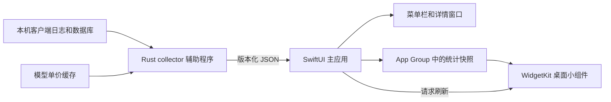

# Tokens macOS 架构与开发约束

日期：2026-09-08。状态：设计基线；性能与系统验收状态见 [VALIDATION.md](VALIDATION.md)。产品需求以 [REQUIREMENTS.md](../REQUIREMENTS.md) 为准。

## 产品边界

本机 AI 用量统计工具，使用 SwiftUI 提供菜单栏、详情窗口与设置，使用 WidgetKit 提供原生桌面小组件。默认本地存储，无排行榜、账号登录、上传或剩余额度功能。估算费用按模型单价计算，不做订阅换算。第一版发行目标是可安装的 macOS 应用；App Store 单独评估。

建议最低 macOS 14，以覆盖系统原生桌面小组件。先验证 Apple Silicon；Intel 支持需独立构建验收，不能由 arm64 测试推定。应用名称、Bundle ID、签名 Team ID 在正式工程初始化时配置，不复用上游品牌标识。

## 组成与数据流

主应用是唯一调度者。辅助程序一次采集后退出，避免把首次扫描的峰值内存长期留在常驻进程。小组件只读取小型聚合快照，不扫描日志，不访问账户凭据，不下载模型价格。

不建立本地 HTTP 服务，不嵌入 Next.js，不引入服务端数据库。复用 `tokens-core`，Swift 不重写解析、Token 去重和日期归属。上游源固定到已验收提交；升级单独比较解析与价格变化。验证工具现已使用仓库内相对依赖；工程采用 `Collector/vendor/` 下固定提交的最小 Rust workspace，保留版本来源和 MIT 声明。需要的逐消息费用/离线价格接口适配集中在这份核心中，避免跨语言复制解析逻辑。

## 统计与费用契约

- 沿用上游 `TokenBreakdown` 的 input/output/cache_read/cache_write/reasoning 和 total 计算。来源字段存在包含关系时，由原解析器归一化，UI 不重复相加或修改。
- 日期按一个持久化的 IANA 时区分桶，首次采用系统时区。验证环境固定 Asia/Shanghai。用户显式更改统计时区时重建聚合，不混用旧数据。
- 客户端支持能力来自上游，但验收范围逐个记录；首批验证 Codex、Claude Code、OpenCode，不把它们误写为产品永久仅支持三个客户端。
- 本机统计意味着读取本机已有数据。依赖账号 API 同步的客户端不能因为上游列为支持，就在无同步功能时宣称可自动获得完整数据。
- 费用单独计算模型单价估值。原核心会优先保留某些来源报告金额，因此不能直接将原 `cost` 全部标为单价估算。需要在最小核心适配处复用其价格匹配与阶梯/缓存计费逻辑，另行输出估算值；不改 Token 统计。
- 单价估算必须在逐条归一化消息上、聚合之前完成；不能对日汇总统一乘单价，避免丢失阶梯计价与缓存结构。当前公开 generate_graph 会初始化价格服务且混用来源金额，正式 collector 需要小范围核心接口适配，不能只改最终 JSON 标签。
- 缺少价格时记录未定价 Token/模型，费用为已知部分并标明不完整；完全无定价时显示不可用，不把零费用当成免费。
- 采集与价格联网更新解耦：允许使用最近成功的价格缓存，并标记价格时间；断网不应使 Token 统计消失。网络只用于公开价格数据，不上传会话内容。

## 采集调度

基于本轮采集实测，工程默认采用 10 分钟，设置提供 5 分钟选项；这是资源成本与更新延迟之间的初始选择，不是电池续航已验收。常驻应用完成后需补做正常使用与能耗观察。每次成功后统一发布一个快照；界面刷新不触发第二套扫描。

调度状态仅需 idle、running。定时与手动请求合并：正在运行时最多记一次待执行请求，禁止并发采集。关闭详情窗口保持菜单栏运行；显式退出停止采集。提供系统支持的登录启动选项。睡眠不强制唤醒，唤醒后最多补采一次，跨日后先完成新一天的采集。

默认采用完整扫描加原版缓存；本机热缓存约 1.3–1.9 秒，峰值约 850 MB。上游 `today_only` 依赖文件修改时间筛选，SQLite 不享受相同的文件级过滤；已验证旧 mtime 会漏掉当日内容，因此第一版不启用。后续优化必须消除此反例并保留对照测试，不以速度理由接受少计。历史窗口与今日快照允许不同更新时间，但必须分别标识，不能拼出看似同时采集的总计。

错误保留最近成功快照，并显示更新时间与错误状态；读取失败不能被当成零用量。上游部分读取路径可能静默跳过，正式适配需要按客户端报告可用性与失败数量，先做可达错误的提示，不扩大为泛化诊断框架。

## 本地进程与快照协议

正式 collector 使用明确参数指定数据目录、缓存目录、日期范围与时区；运行时用参数数组启动内置绝对路径程序，禁止拼接 shell。stdout 只输出一个 JSON 文档，stderr 输出诊断；非零退出代表失败。主应用校验协议版本和数值，再写共享快照。

拟定协议版本 `schemaVersion: 1`，字段如下，作为开发包共同输入：

| 字段 | 含义 |
| --- | --- |
| schemaVersion | 兼容性版本；不识别时保留旧快照并提示升级 |
| generatedAt | 成功采集完成的 UTC 时间 |
| timezone | 本次日期归属使用的 IANA 时区 |
| range | since、until；不得将今日数据标为全部历史 |
| totals | Token 五类分项与 total，使用 64 位整数 |
| estimatedCost | amountUsd 可空、complete、unpricedTokens、pricingAsOf |
| daily | 按日期排序的聚合，用于趋势图 |
| clients | 客户端分项、可用状态与最后成功时间 |
| models | 模型分项及未定价状态 |

不要把模型数或会话数转换成浮点再回转整数。Swift 与 Rust 使用同一份合成 JSON 样例验收字段，未知版本、截断文件、零用量和价格缺失都需覆盖。

collector 的消息缓存留在应用私有目录；仅聚合快照进入 App Group。主应用为唯一写入者，临时文件写完后原子替换；小组件读取失败时用最近可读数据或明确占位。真实日志、项目路径、会话标题不进入小组件共享数据或外部 Worker 任务材料。

## 界面与桌面小组件

菜单栏默认显示今日 Token，点击后看到估算费用、客户端分项、更新时间、刷新和打开详情。详情窗口提供今日/近七天/本月与模型分布，不在首版添加账户管理。

桌面小组件先做小号和中号：小号展示今日 Token、估算费用与更新时间；中号增加客户端分项。点击打开应用。字体支持系统设置，暗色与桌面着色模式使用系统语义样式。

采集完成后写共享数据，再调用 `WidgetCenter.reloadTimelines`。WidgetKit 的刷新由系统管理；后台菜单栏常驻不能直接按“前台应用免刷新预算”理解。实际显示延迟需要在关闭开发者刷新豁免的条件下测量。timeline 可安排跨日状态变更，但不能伪造未来用量。过期数据保留日期，不能把昨天的数值改标签显示为今天。

## 发行与权限

直接发行路径使用 `.app` 包含签名的 helper 与 `.appex`，通过 DMG 等安装载体交付。正式分发需验证 Developer ID 签名、公证与 Gatekeeper；本地类型检查或 ad-hoc 签名不能代替发行验证。

主应用可采用直接发行的非沙盒模式；Widget 扩展按系统要求配置沙盒与 App Group。App Group 的 Team、entitlement、共享容器访问及安装后小组件注册必须在同一真实签名配置下验收。不上 App Store 不等于无需处理扩展签名与权限。

本机已安装 Xcode 26.6，首次初始化与 WidgetKit 类型检查通过，Apple Personal Team 已登录，自动开发签名经用户明确授权后已完成，最小 app/widget 的签名构建通过。详见 [环境复验](XCODE-ENVIRONMENT.md)。最小验证工程已完成真实桌面的小号/中号小组件安装、共享数据、后台写入刷新和退出后数据显示，见 [前置验收](PREPARATION.md)。正式应用按下述开发包继续实施。Mac App Store 的沙盒数据目录授权、helper 权限与审核另开发行阶段，不保证上架。

## Codex 与 Muse 分工

Codex 负责架构、统计口径、授权、任务拆分、集成、真实本机数据测试和最终验收。Muse 通过 OpenCode Worker 插件执行有文件所有权的任务，固定 `opencode-go/muse-spark-1.3-contributor` 与 `Sisyphus - ultraworker`，不静默切换模型。

每个任务包含目标、可读公开材料、精确可写文件、精确允许命令、输入输出契约与验收标准。运行时保持所有权，确认停止后才能返工或重新分配。Worker 的完成状态不代表验收通过；查看实际差异、工具错误，并由 Codex 运行关键检查。

真实日志与凭据只由 Codex 在本机处理。外部 Worker 只收到公开上游代码、合成样例和必要的汇总性能指标。编译权限被限制时返回阻塞原因，不允许根据猜测伪造上游接口。

## 参考

- [上游核心快照](https://github.com/missuo/tokens/tree/75aba190695c9de5f2695d9baba6afd3c8cb63f8/cli/tokens-core)
- [WidgetKit 刷新机制](https://developer.apple.com/documentation/widgetkit/keeping-a-widget-up-to-date/)
- [App Groups](https://developer.apple.com/documentation/xcode/configuring-app-groups)
- [App Sandbox](https://developer.apple.com/documentation/security/app-sandbox)
